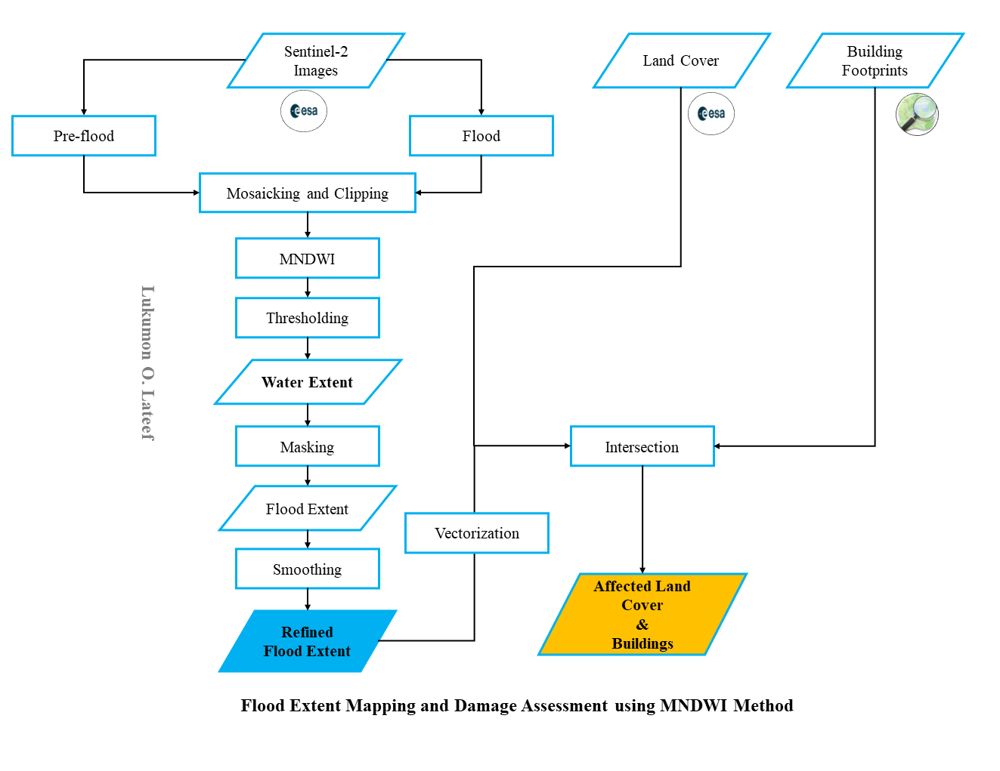

# Flood Extent Mapping and Damage Assessment Along Tana River, Kenya
## Abstract
Kenya experienced devastating flooding between mid-April to May 2024 that caused the loss of lives and properties and the displacement of people from their houses. The flood is caused by continuous rainfall and overflow of rivers/dams [(OCHA, 2024)](https://reliefweb.int/disaster/fl-2024-000045-ken).

I used the available optical sentinel-2 images in April to extract the flood extent along the Tana River, which is one of the affected locations. The images were pre-processed and analysed to extract the flood extent layer and permanent water bodies. The Normalised Modified Water Index (MNDWI) was adopted. The preliminary damage assessment was performed using the integration of the flood extent layer, land cover data, and building footprints from OSM. The flood mapping and damage assessment were done using Google Earth Engine Python API with geemap and the layers were exported to QGIS for final map preparation.

The result reveals that Shrubland and cropland are the most affected land cover. Also, more than 2000 buildings are affected. Infrastructures such as roads and bridges are also affected, which could cut off the affected population from other parts of the country and make rescue operations challenging. These findings show a significant impact of the flood on the local communities as it affected many of their buildings and cropland, which means displacement of people, loss of livelihoods and biodiversity and disruption in economic activities. This work demonstrates the capabilities of GIS technologies for rapid disaster response and planning and the benefits of freely available datasets. Geospatial Technologies are crucial in disaster management as they enable us to get swift information about the affected population and land cover (features and properties) during a disaster, facilitating search and rescue operations and effective post-flooding compensation/support for the affected people.
Workflow

## Workflow

## Result Snippets

## References
Xu, H. (2006). Modification of normalised difference water index (NDWI) to enhance open water features in remotely sensed imagery. International Journal of Remote Sensing, 27(14), 3025–3033. https://doi.org/10.1080/01431160600589179

OCHA (2024). Kenya: Floods - Apr 2024. https://reliefweb.int/disaster/fl-2024-000045-ken. Accessed 25 May 2024 

Gabriel (@GMMunyoki)/ X. Retrieved from: https://x.com/GMMunyoki/status/1785281515317784627. Accessed 03 May 2024
